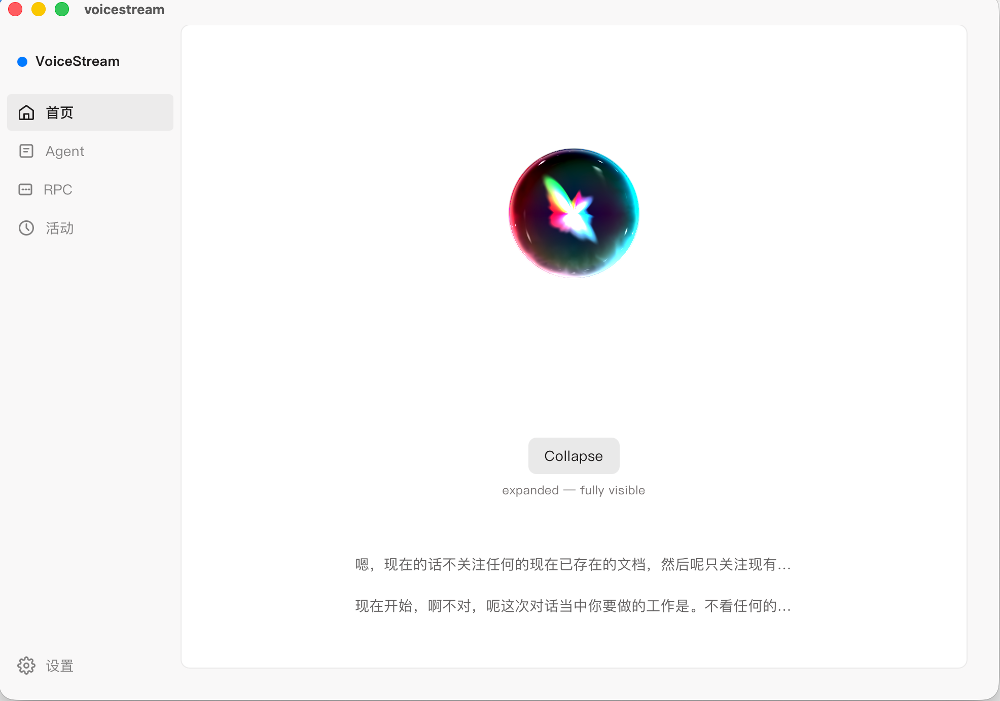
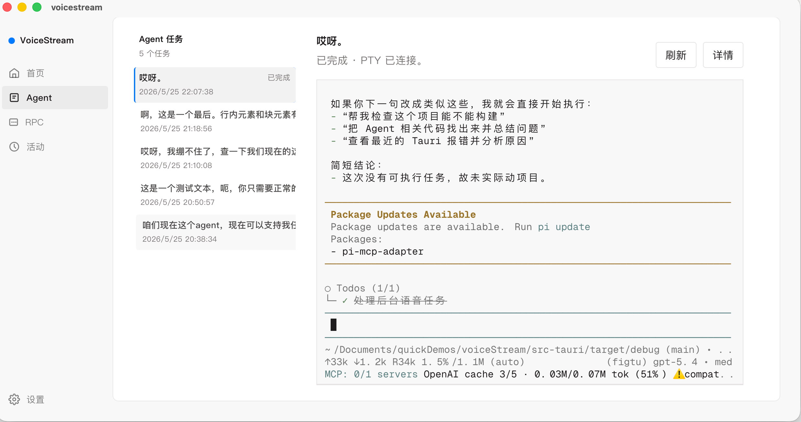
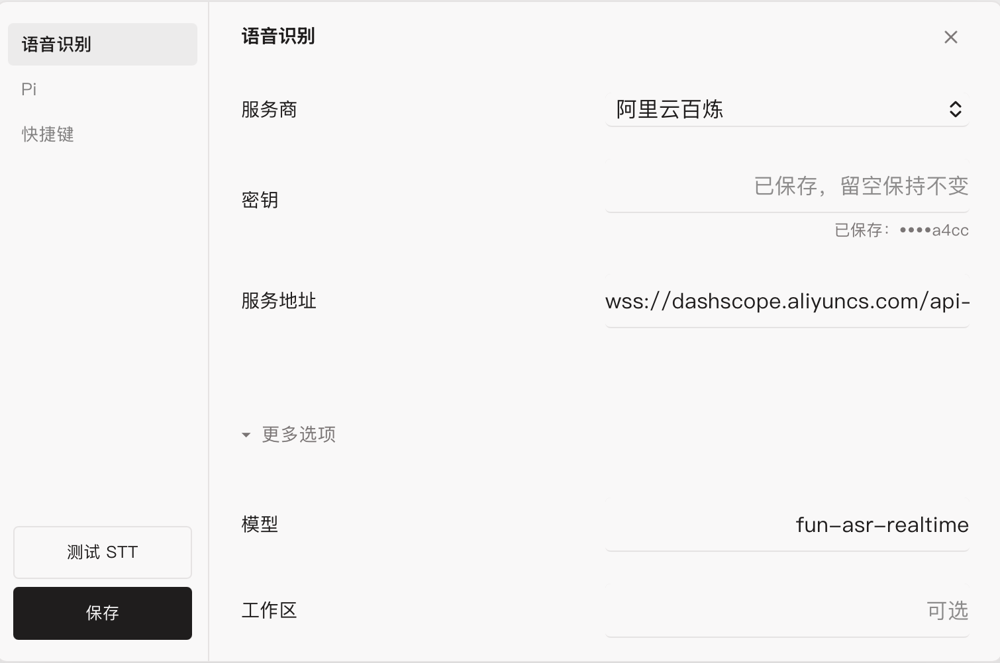
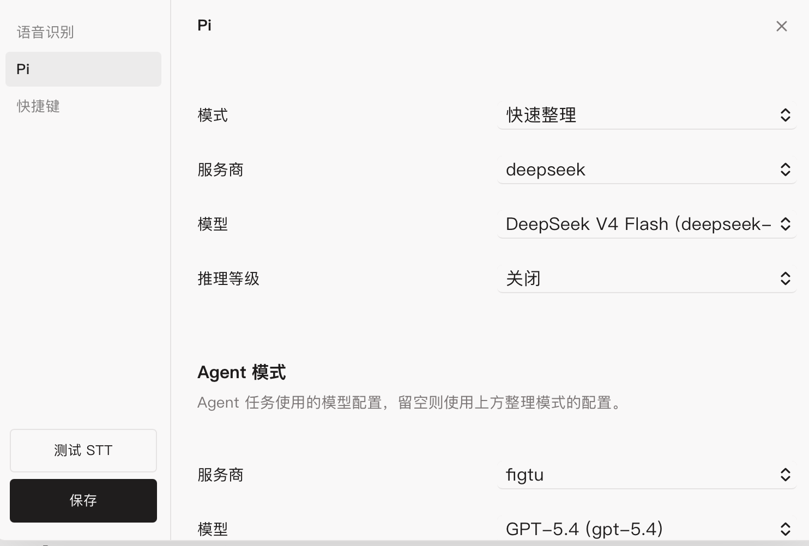
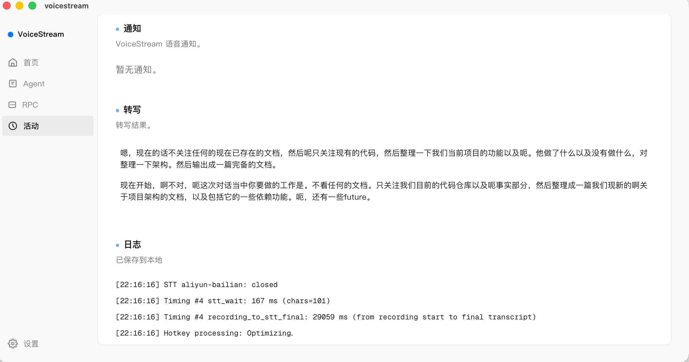
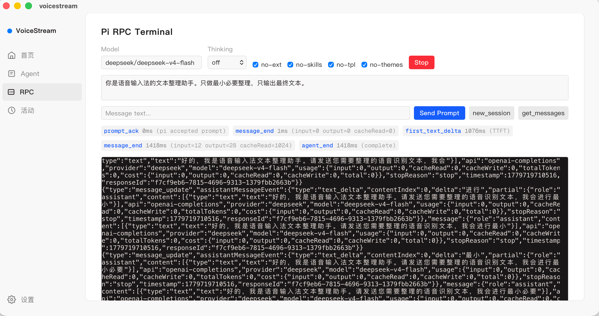

<div align="center">

<picture>
  
</picture>

### VoiceStream: Voice-Driven Everything

**Just Speak. Get Things Done.**

Turn your voice into text, refined output, or background agent tasks on your Mac.

<a href="./quick-start.md">Quick Start</a> · <a href="./ARCHITECTURE.md">Architecture</a> · <a href="https://github.com/anthropics/voicestream/issues">Issues</a> · <a href="./docs">Docs</a>

[](https://github.com/anthropics/voicestream)
[](./LICENSE)
[](https://tauri.app)
[](https://www.rust-lang.org)

Inspired by: <a href="https://www.typeless.com/">Typeless</a> · <a href="https://github.com/joewongjc/type4me">Type4Me</a>

English / [中文](./README.md)

</div>

***

## Promo Video

<div align="center">

[](https://www.bilibili.com/video/BV1wYGo6cEic/?vd_source=c0c5db05014578f493b993d4b1d3e6fc)

</div>

***

## Project Notes

<details>
<summary><strong>Q: Commit Timeline</strong></summary>

The event requires all commits to fall between May 22–25, 2026. Commits before May 22 are pre-existing reused code.
</details>

<details>
<summary><strong>Q: Project Background</strong></summary>

VoiceStream is a pre-existing repository that was refined and documented during the 3-day event window (May 22–25).
</details>

<details>
<summary><strong>Q: Code Reuse</strong></summary>

The reused code is the entire pre-existing repository codebase. Additionally, the homepage ShaderOrb animation is inspired by the [Reacticx Siri Orb](https://www.reacticx.com/docs/components/siri-orb) component.
</details>

<details>
<summary><strong>Q: Third-Party Libraries & Frameworks</strong></summary>

**Frontend (package.json):**
- [React 19](https://react.dev) + [React DOM](https://react.dev)
- [TanStack Router](https://tanstack.com/router) — Routing
- [Zustand](https://zustand.docs.pmnd.rs) — State management
- [Motion](https://motion.dev) — Animation
- [xterm.js](https://xtermjs.org) — Terminal rendering
- [Tailwind CSS 4](https://tailwindcss.com) — Styling
- [Vite 7](https://vite.dev) — Build tool
- [@tauri-apps/api](https://tauri.app) — Tauri frontend API
- [Geist Mono](https://vercel.com/font) — Font

**Backend (Cargo.toml):**
- [Tauri 2](https://tauri.app) — Desktop framework
- [cpal](https://github.com/RustAudio/cpal) — Audio capture
- [tokio-tungstenite](https://github.com/snapview/tokio-tungstenite) — WebSocket
- [portable-pty](https://github.com/nickelc/portable-pty) — Pseudo-terminal
- [rusqlite](https://github.com/rusqlite/rusqlite) — SQLite
- [arboard](https://github.com/1Password/arboard) — Clipboard
- [objc2](https://github.com/madsmtm/objc2) — macOS native UI
</details>

***

## Overview

Inspired by [Typeless](https://www.typeless.com/), OpenTypeless, and [Type4Me](https://github.com/joewongjc/type4me) — VoiceStream goes further: if voice can refine text, why not let it execute tasks?

Rather than reinventing the wheel, VoiceStream reuses your local Coding CLI as the AI backend. Pi is the first-class integration, chosen for its complete extension system (tool use, session persistence, extension loading).

> **Recommended Setup:** In our testing, DeepSeek V4 Flash with No Thinking mode averages 1–2 second response times for text refinement — ideal for frequent short dictation. Chinese-native models excel in Chinese language contexts.

## How It Works

| Mode | Trigger | Effect |
|------|---------|--------|
| **Dictation** | `Cmd+Shift+Space` | Voice → STT → AI refine → paste at cursor |
| **Agent** | `Cmd+Shift+A` | Voice → STT → Pi agent session (with tools) → notify when done |

Both modes display a native floating HUD with real-time transcription and waveform animation.

---

## Home

<p align="center">
  
</p>

The homepage features a WebGL2 shader orb that responds to microphone volume in real time. Below it are recent transcription records. The footer shows current shortcut bindings — press and start talking.

---

## Agent Tasks

<p align="center">
  
</p>

After giving a voice command, VoiceStream creates an Agent task and executes it in the background. The left panel shows the task list (with status and timestamps), the right panel shows live terminal output — you can see what the Pi agent is doing, which tools it's calling, and what results it produces. On completion, results are spoken aloud via macOS `say`.

---

## Settings: Speech Recognition

<p align="center">
  
</p>

Supports 6 real-time STT providers (Aliyun Bailian, Deepgram, AssemblyAI, Soniox, Gladia, OpenAI Realtime). Selecting a provider auto-fills the default endpoint and model — just add your API key. Click "Test STT" to verify the connection.

---

## Settings: Pi Model

<p align="center">
  
</p>

Pi settings are split into two sections:

- **Refinement mode**: For post-dictation text polishing. Choose provider, model, and thinking level.
- **Agent mode**: For voice Agent tasks. Can be configured with a stronger model independently (e.g., GPT-5.4), or left empty to follow refinement mode settings.

VoiceStream automatically reads `settings.json` and `models.json` from `~/.pi/agent/` — configured providers and models appear directly in the dropdowns.

---

## Activity Log

<p align="center">
  
</p>

The activity page has three sections:

- **Notifications**: Voice notification records for completed/failed Agent tasks
- **Transcripts**: Raw STT transcription results
- **Logs**: System logs including STT connection status and timing data (e.g., `stt_wait: 167ms`, `recording_to_stt_final: 29059ms`)

---

## RPC Debug Terminal

<p align="center">
  
</p>

Developer tool. Interact directly with the Pi RPC process — configure model, thinking level, system prompt, send JSON-RPC commands and view raw response streams. Performance metrics shown: `prompt_ack`, `first_text_delta` (TTFT), `message_end` (total time and token usage).

---

## Features

- **Global hotkeys** — works in any app, no window switching
- **Real-time STT** — streaming WebSocket transcription with 6 providers
- **AI text refinement** — corrects recognition errors, adds punctuation, preserves tone
- **Agent tasks** — give voice commands to a full coding agent running in the background
- **Native HUD** — macOS glass-effect floating panel with live transcript
- **Voice notifications** — agent results spoken aloud via macOS `say`
- **Multiple prompt templates** — default, light, structured, official-lite, list-friendly
- **Customizable shortcuts** — Agent hotkey can be freely reassigned

## Requirements

- macOS (native HUD and accessibility features)
- [Pi CLI](https://github.com/anthropics/pi) installed locally
- At least one STT provider API key
- Accessibility permission (for paste simulation)
- Microphone permission

## Quick Start

```bash
# Install dependencies
pnpm install

# Run in development
pnpm tauri dev

# Build for production
pnpm tauri build
```

First launch:
1. Grant Accessibility permission
2. Open Settings → Speech → configure STT provider and API key
3. Open Settings → Pi → select model provider
4. Press `Cmd+Shift+Space` and start talking

## Tech Stack

| Layer | Technology |
|-------|-----------|
| Desktop | Tauri 2 (Rust) |
| Frontend | React 19, TypeScript, Vite 7 |
| Routing | TanStack Router |
| State | Zustand |
| Styling | Tailwind CSS 4 |
| Audio | cpal |
| AI Backend | Pi CLI (JSON-RPC) |
| Database | SQLite |
| Native UI | macOS AppKit (objc2) |

## Project Structure

```
src-tauri/src/
├── lib.rs              # Entry point, recording, hotkeys, paste
├── audio.rs            # PCM resampling, channel conversion
├── stt.rs              # STT unified interface + Aliyun Bailian
├── stt_providers/      # Deepgram, AssemblyAI, Soniox, Gladia, OpenAI
├── pi_rpc.rs           # Pi JSON-RPC communication
├── agent_tasks.rs      # Agent task management
├── agent_terminal.rs   # Agent PTY terminal
├── native_hud.rs       # macOS native floating HUD
├── settings.rs         # Settings read/write/migration
└── db.rs               # SQLite schema and migrations

src/
├── pages/              # UI pages
├── stores/             # Zustand state stores
├── components/         # ShaderOrb, SettingsDialog, etc.
└── hooks/              # Tauri event subscriptions

pi-extensions/
└── voicestream-notify.ts  # Pi extension: AI summary + speech
```

## Configuration

Settings stored at `~/Library/Application Support/com.voicestream.app/app-settings.json` (permissions 0600).

Environment variable overrides:
- `VOICESTREAM_PI_PROVIDER` — force Pi provider
- `VOICESTREAM_PI_MODEL` — force Pi model
- `VOICESTREAM_PI_MODE` — force Pi mode
- `VOICESTREAM_PI_REUSE_PROCESS` — toggle process reuse
- `VOICESTREAM_PI_PATH` — custom Pi binary path
- `VOICESTREAM_PI_THINKING` — thinking level override

## License

MIT
