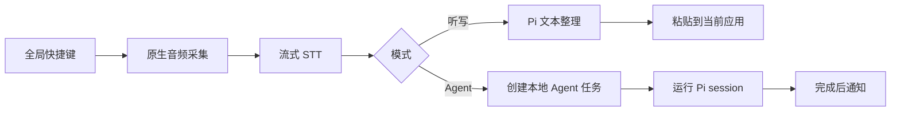

# VoiceStream

**在任何应用里开口输入；需要办的事，顺手交给 Agent。**

[English](./README.md)

VoiceStream 是一个面向 macOS 的语音输入原型。按下全局快捷键，直接说话，
它会把语音变成干净文本，并粘贴到当前焦点应用里。如果你说的是一个任务，
可以用 Agent 模式交给后台 Pi session 执行，完成后再通知你。

> 状态：活跃原型。当前实现面向 macOS 和本地开发，还不是已经打包发布的
> 公共版本。

## 为什么做 VoiceStream

很多语音工具要求你先打开一个单独应用，在里面听写，再把结果复制回原来的
地方。VoiceStream 的目标是让输入发生在光标已经所在的位置。

它有两条路径：

- **听写**：语音变成整理后的文本，并粘贴到当前应用。
- **Agent**：语音变成后台任务，在本地 Pi session 中执行。

## 参考项目

VoiceStream 的产品和工作流主要参考了这些语音输入产品与项目：

- [Typeless](https://www.typeless.com/)
- [Type4Me](https://github.com/joewongjc/type4me)

## 当前能力

- 全局听写快捷键：`Cmd+Shift+Space`
- 独立 Agent 快捷键：`Cmd+Shift+A`
- 支持按住说话和点按锁定录音
- 通过 Rust/Tauri 做原生音频采集
- 通过阿里云百炼做流式 STT
- 用原生 macOS HUD 胶囊展示录音、处理中、成功和错误状态
- 粘贴前通过 Pi 做文本整理
- 使用剪贴板 + `Cmd+V` 自动粘贴
- 本地保存 Agent 任务历史
- 在管理面板中打开 Agent session 终端
- Agent 完成或失败后发送 macOS 通知
- 本地保存设置，API Key 可清空

## 工作流程



## 快速开始

### 环境要求

- macOS
- Node.js 和 `pnpm`
- Rust 工具链
- Tauri 所需环境
- 阿里云百炼实时语音识别凭证
- 本机可用的 Pi CLI，用于文本整理和 Agent 模式
- 自动粘贴需要 macOS Accessibility 权限

非 macOS 环境下的行为是 `uncertain`；当前原型依赖 macOS 音频、全局快捷键、
HUD、剪贴板、粘贴和通知流程。

### 安装依赖

```bash
pnpm install
```

### 启动

```bash
pnpm tauri dev
```

### 配置

打开应用设置面板，配置：

- 阿里云百炼 API Key
- STT endpoint
- STT 模型
- 可选的 workspace ID
- 必要时配置 Pi provider/model 覆盖

应用配置保存在 app support 目录下的 `app-settings.json`。旧版
`credentials.json` 会尽量迁移。类 Unix 系统下，配置文件会以 `0600`
权限写入。

## 使用方式

| 快捷键 | 模式 | 行为 |
| --- | --- | --- |
| `Cmd+Shift+Space` | 听写 | 录音、流式识别、整理文本、粘贴到当前应用 |
| `Cmd+Shift+A` | Agent | 录制口头任务、创建后台 Agent session、完成后通知 |

两种快捷键都支持两种录音方式：

- 按住快捷键开始录音，松开结束。
- 点按一次进入锁定录音，再按下并松开一次结束。

当前 UI 中，听写快捷键是固定的。Agent 快捷键可以在 Shortcuts 页面修改并
保存到本地。

## 配置项

| 区域 | 控制内容 |
| --- | --- |
| STT | API Key、endpoint、模型、workspace ID |
| Pi | 模式、provider、模型、进程复用、提示词模板、provider JSON 覆盖 |
| Shortcuts | Agent 快捷键 |
| 本机 Pi 参考 | 只读展示 `~/.pi/agent/settings.json` 和 `~/.pi/agent/models.json` |

原始 Pi 配置只作为参考展示。VoiceStream 不会直接修改这些文件。

## 开发命令

```bash
pnpm build
scripts/voicestream-dev.sh dev-fast
scripts/voicestream-dev.sh dev-agent
scripts/voicestream-dev.sh cargo-check
scripts/voicestream-dev.sh test-pi-rpc
```

辅助脚本默认使用：

- `VOICESTREAM_PI_PROVIDER=aliyun-bailian`
- `VOICESTREAM_PI_MODEL=qwen3.5-flash`
- `VOICESTREAM_PI_MODE=dictation-fast`

这些值都可以通过环境变量覆盖。

## 项目结构

```text
src/
  App.tsx                 React 管理面板
  App.css                 全局样式和 Tailwind token
src-tauri/src/
  lib.rs                  Tauri 命令、快捷键、录音生命周期
  audio.rs                原生音频采集
  stt.rs                  阿里云百炼流式 STT
  native_hud.rs           原生 macOS HUD 胶囊
  pi_rpc.rs               Pi RPC 集成
  agent_tasks.rs          本地 Agent 任务存储与 session 解析
  agent_terminal.rs       内嵌 Agent PTY 桥接
  settings.rs             应用设置与 Pi 配置映射
pi-extensions/            随应用打包的 Pi extensions
scripts/                  开发辅助脚本
docs/                     产品、功能和技术文档
```

## 文档

- [macOS menu-bar voice input](./docs/features/macos-menubar-voice-input.md)
- [Agent mode and toggle hotkey](./docs/features/agent-mode-and-toggle-hotkey.md)
- [HUD capsule](./docs/features/hud-capsule.md)
- [Prompt design](./docs/prompt-design.md)
- [VAD notes](./docs/tech/vad.md)
- [Desktop surface spec](./docs/specs/voice-workbench-layout.md)

## 已知限制

- 当前是原型，还没有按公共发布版本来整理打包说明。
- 主要支持平台是 macOS。
- 自动粘贴可能需要 Accessibility 权限。
- STT 需要配置阿里云百炼。
- Pi 文本整理和 Agent 模式需要本机 Pi CLI 可用。
- 如果前端运行时没有真实音量事件，不应假设能显示真实 amplitude；此时
  amplitude 行为是 `uncertain`。

## License

当前仓库里没有 license 文件。
